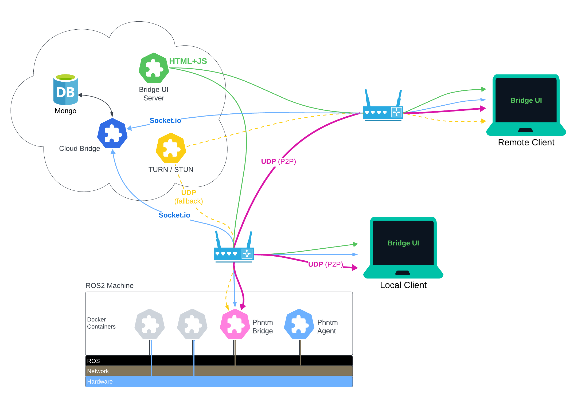

:github_url: https://github.com/PhantomCybernetics/phntm_bridge_docs/edit/main/basics/architecture.rst

Architecture
============

`WebRTC <https://en.wikipedia.org/wiki/WebRTC>`_ is a real-time communication standard that allows fast
video, voice, and generic data to be sent between peers.

Peers (such the Bridge node on a ROS2 machine, or the Web UI used by the operator) connect P2P when possible over the local network. A signalling server (Cloud Bridge)
is necessary to establish the connection, and a TURN/STUN server is used as a fallback option in cases when direct P2P link is not available.

Once the connection is established, binary `UDP protocol <https://en.wikipedia.org/wiki/User_Datagram_Protocol>`_ is utilized for both data and media streams, allowing for much higher speeds 
than TCP at the cost of packet reliability. Where reliable delivery is required, extra measures are taken to make sure the data is actually delivered.

`WebSockets <https://en.wikipedia.org/wiki/WebSocket>`_ (namely Socket.io) are used as a reliable means of communication between the Peers, with the Cloud Bridge acting as a central relay.

To start using this Bridge, you only need to :doc:`install the Bridge node </basics/install>` (plus the included Agent) on your ROS2 machine.

The aforementioned cloud services and Web UI are all hosted by Phantom Cybernetics and provided free of charge.
However, you can also :doc:`install these on your own infrasturcure </self-hosted>` and host everything yourself, should you so desire.

The Bridge node performs various data-specific optimazations and conversions. Sometimes, it will drop older messages on purpose
in favor of low latency. This behavior is intentional and by design baked into Phantom Bridge. The goal is not to provide 1:1
copy of all ROS data, but rather to meaningfully optimize and compress it in order to provide accurate and fast representation of the machine's
internal state over the network.

Phantom Bridge is distributed as a Docker container but also
allows for monitoring and control of other Docker containers installed on your machine.
This enables ROS nodes pre-configured as individual Docker Compose services
to be started or stopped as needed via the Web UI or a ROS service, thus effectively re-configuring the robot on the fly.