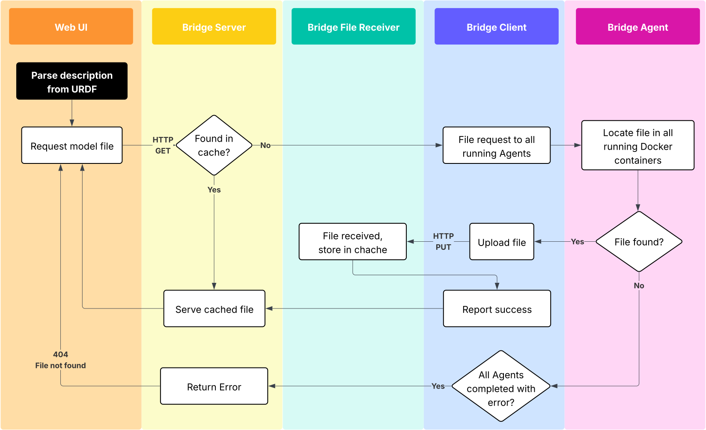

:github_url: https://github.com/PhantomCybernetics/phntm_bridge_docs/edit/main/file-extraction.rst

File Extraction
===============

In certain situations, it is very useful to be able to locate and extract files from running Docker containers on a ROS2-enabled machine.
These can be for instance URDF mesh files (STL, OBJ, DAE), as used and displayed by the Scene View widget.

Files are uploaded to the Bridge Server, cached and served from there on subsequent requests to save on robot's networking bandwidth.

TODO Notes:
 - package:// or file:// urls are supported
 - when locating package, it is important that the container has $ROS_WS environmental variable set, as we need to source the environment form $ROS_WS/install/setup.bash
   during the search, ~/.bashrc is also sourced to you can source your ROS2 environment there
 - thanks to standalone Agent, it is possible to extract files from all parts of a distributed system
 - clear cache service