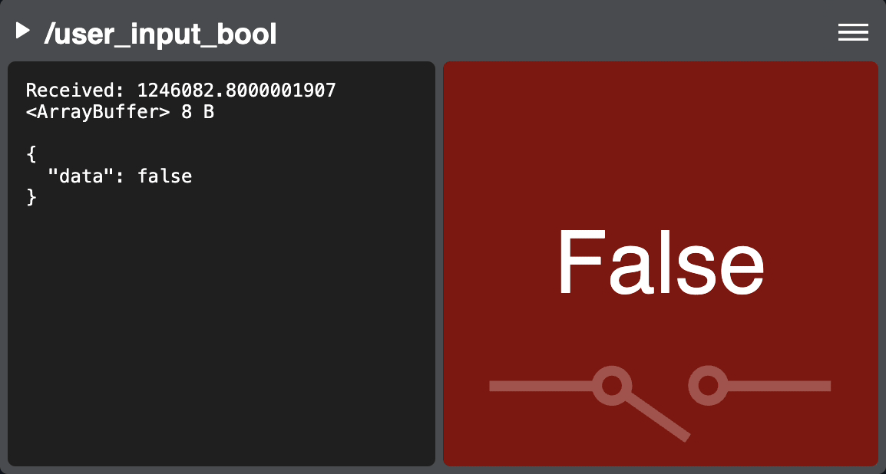

Bool (Single-topic Example)
===========================

Declared in `bool-panel-widget.js <https://github.com/PhantomCybernetics/bridge_ui_extras/tree/main/examples/custom-bool-panel-widget>`_

This widget is an example of extending the :doc:`SingleTypePanelWidgetBase </ui-api-docs/SingleTypePanelWidgetBase>` class to create a single-type panel.
It displays a ``std_msgs/msg/Bool`` topic as text and a visual to demonstrate how to create a simple 2D data visualization and
use custom graphics.

It uses a custom CSS and reads the `color_true` and `color_false` values from custom topic params in the
configuration YAML file on the robot. It also shows how to add custom items into the panel's menu.
Lastly, it demonstrates how to store and load state variables from `panel vars`. These are stored in the
page's URL and preserved between reloads.

You can see this widget in action by subscribing to the `/user_input_bool` topic in the :doc:`live demos </demos>`
and selecting the `Bool Test` input profile (any mapped key will then generate a `true` message).

.. rubric:: Configuration options

.. code-block:: yaml
   :caption: phntm_bridge.yaml

    /**:
      ros__parameters:

        /user_input_bool:
          color_true: '#00089bff'
          color_false: '#920000ff'

