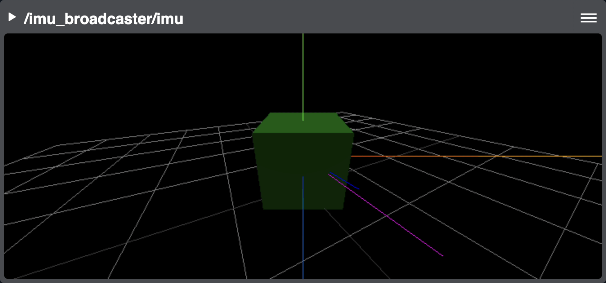

Imu
===

Declared in `imu.js <https://github.com/PhantomCybernetics/phntm_bridge_ui/blob/main/static/widgets/imu.js>`_

This panel displays IMU data from ``sensor_msgs/msg/Imu`` topics as rotation in 3D, plus it can show linear acceleration in a 2D graph.

.. rubric:: Configuration options

.. code-block:: yaml
   :caption: phntm_bridge.yaml

    /**:
      ros__parameters:

        /some_imu_topic:
          min_acceleration: -11.0
          max_acceleration: 11.0