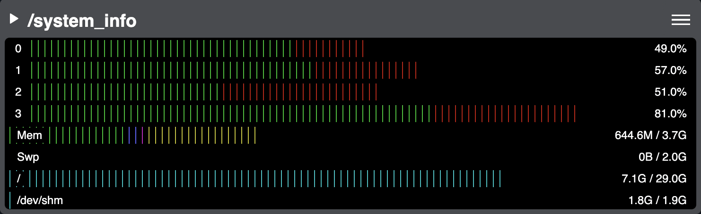

:github_url: https://github.com/PhantomCybernetics/phntm_bridge_docs/edit/main/ui-widgets/system-info.rst

System Info
===========

Declared in `system-load.js <https://github.com/PhantomCybernetics/phntm_bridge_ui/blob/main/static/widgets/system-load.js>`_

This panel displays system CPU load, memory and swap utilization, and free space for monitored disk volumes.
The info is generated by Phantom Agent via ``phntm_interfaces/msg/SystemInfo`` topics.

.. rubric:: Configuration options

.. code-block:: yaml
   :caption: phntm_bridge.yaml or phnrm_agent.yaml

    /**:
      ros__parameters:

        agent_update_period_sec: 0.5 # Agent update rate

        system_info_topic: '/system_info' # Agent writes output here, '' to disable
        disk_volume_paths: [ '/', '/dev/shm' ] # volumes to monitor, must be accessible from the container, [ '/' ] default