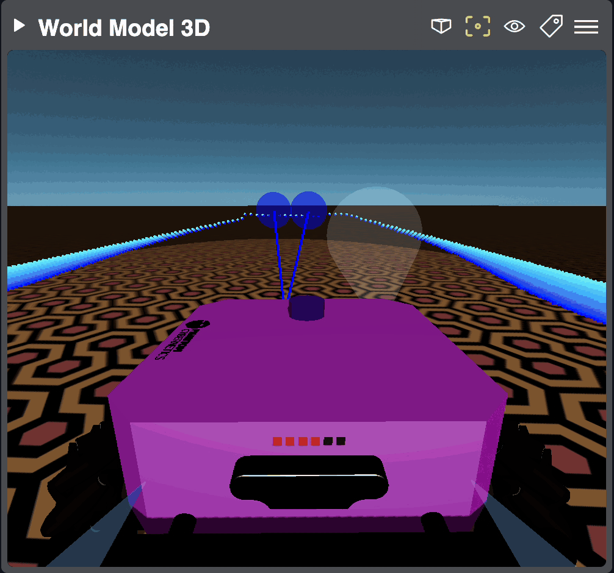

World Model 3D
==============

.. raw:: html

   <video autoplay loop class="world-model-widget">
      <source src="/bridge/video/wolrd-model-3d-widget.mp4" type="video/mp4">
      Your browser does not support the video tag.
    </video>

Declared in `world-model-base.js <https://github.com/PhantomCybernetics/phntm_bridge_ui/tree/main/static/widgets/world-model-3d>`_

This is a *composite* widget that displays the URDF model from ``/robot_description`` and updates it with transforms from ``/tf_static`` and ``/tf``.
Model files are :doc:`discovered on the robot </file-extraction>`, uploaded to the Bridge Server and cached there. Supported mesh formats are STL and DAE.
The widget expects the ``/robot_description``, ``/tf_static`` and ``/tf`` topics to exists and tries to subscribe to them.
The ``/tf_static`` and ``/robot_description`` topics should be subscribed to as `RELIABLE` to make sure every published message is received,
the ``/tf`` topic is expected to be `BEST_EFFORT` and update continuously.

The robot's model only updates when `/robot_description` changes, or on page reload. Call the ``/phntm_bridge/clear_cloud_file_cache`` service to invalidate
the model cache on the Bridge server, then reload the page to fetch the models again.

The URDF model can be meshed with additional data via overlays, several are implemented out-of-the-box and you can also create your own.

This widgets allow to switch beween orthographic and perpective camera. Skybox, light and ground plane can be also ajusted.

.. rst-class:: overlay-section

CameraInfo Overlay
------------------

Declared in `camera-info.js <https://github.com/PhantomCybernetics/phntm_bridge_ui/blob/main/static/widgets/world-model-3d/camera-info.js>`_

This overlay displays camera frustums based on the camera model received as ``sensor_msgs/msg/CameraInfo`` messages. Each frustum is mapped into the 
corresponding `frame_id` frame on the robot's URDF model. You can set the display frustum color, near and far plane and even force `frame_id` in your
`phntm_bridge.yaml` config file.

.. code-block:: yaml
   :caption: phntm_bridge.yaml

    /**:
      ros__parameters:

        /rgb_front/camera_info:
          frustum_color: 'lime' # color name or hex (e.g. '#00ff00')
          frustum_near: 0.1
          frustum_far: 10.0
          force_frame_id: 'some_frame_id'

.. rst-class:: overlay-section

Detection3DArray Overlay
------------------------

Declared in `detections3d.js <https://github.com/PhantomCybernetics/phntm_bridge_ui/blob/main/static/widgets/world-model-3d/detections3d.js>`_

This overlay displays ``vision_msgs/msg/Detection3DArray`` topic messages, which are often used in computer vision,
as simple oriented 3D bounding boxes or objects in the 3D scene. You can configure both label map, colors and 3D models to be used
for visualizations. The 3D models are :doc:`extracted </file-extraction>` from your ROS machine, STL and DAE formats are supported.
All detections are mapped into the correct frames on the robot model according to the `frame_id` received in message headers.

.. code-block:: yaml
   :caption: phntm_bridge.yaml

    /**:
      ros__parameters:

        /some_3d_detection_topic:
          label_map: [ 'person', 'woman', 'man', 'camera', 'TV' ] # class label map
          color_map: [ 'red', '#00ff00', 'blue', NULL, 'magenta' ] # colors to use for each class
          model_map: # must be in the same order as the label_map
            - package://path_to_model/person_model.stl scale=[1.0,1.0,1.0] # stl model with scale set
            - file://path_to_model/woman_model.dae
            - none # no model, use oriented bounding box (NULL works, too)
            - file://path_to_model/camera_model.dae scale=[2.0,2.0,2.0] # collada model with scale set
            - cylinder scale=[1.0,2.0,1.0] # primitive with scale set, supported primitives are box, cylinder and sphere
          use_model_materials: True # whether to use model's own materials (default), or just a color (magenta by default)

.. rst-class:: overlay-section

LaserScan Overlay
-----------------

Declared in `laser.js <https://github.com/PhantomCybernetics/phntm_bridge_ui/blob/main/static/widgets/world-model-3d/laser.js>`_

Displays ``sensor_msgs/msg/LaserScan`` messages as 3D laser hits, mapped into the robot's `frame_id` received in message headers.

.. rst-class:: overlay-section

Range Overlay
-------------

Declared in `range.js <https://github.com/PhantomCybernetics/phntm_bridge_ui/blob/main/static/widgets/world-model-3d/range.js>`_

Displays ``sensor_msgs/msg/Range`` range detection messages as 3D cones mapped into the robot's `frame_id` received in message headers.
The `min_range` and `max_range` values are taken into account when rendering.

.. _implementing-custom-world-model-3d-overlays:

Implementing Custom Overlays
----------------------------

We will be adding more 3D overlays such as `visualization markers <https://github.com/PhantomCybernetics/phntm_bridge_ui/issues/7>`_ or
`path planning <https://github.com/PhantomCybernetics/phntm_bridge_ui/issues/10>`_, and so can you.
In order to create a custom overlay plugin, you'll need to extend the :doc:`WorldModel3DPluginBase </ui-api-docs/WorldModel3DPluginBase>` class.
You can examine source code of all the overlays mentioned above for inspiration.

There's one extra simple example available in the `Bridge UI Extras repo <https://github.com/PhantomCybernetics/bridge_ui_extras/blob/main/examples/custom-world-model-battery-plugin/world-model-battery-plugin.js>`_
which displays the ``sensor_msgs/msg/BatteryState`` topic messages as virtual battery LEDs on back of the robot's model in our :doc:`demos </demos>`.

See more details about creating, hosting and loading your own extensions
in :doc:`Customizing the User Interface </ui/customizing>`.

