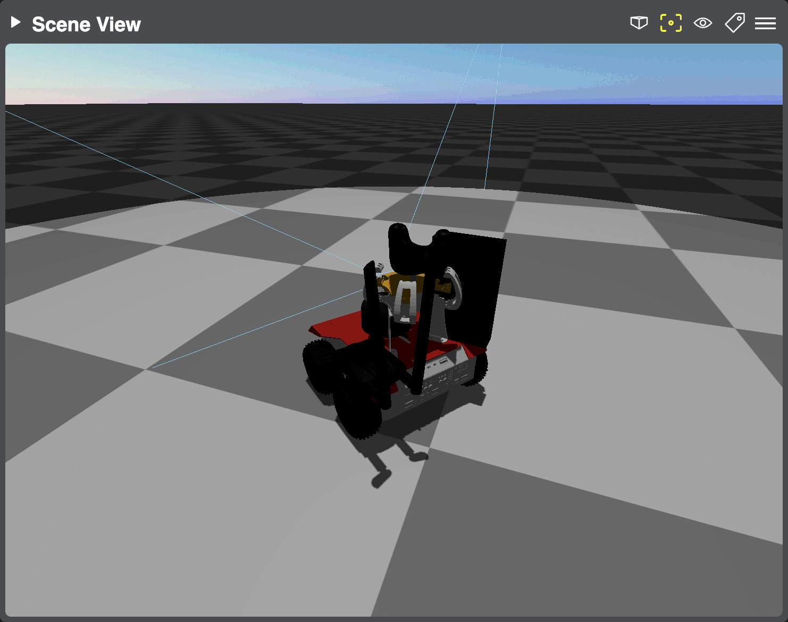

World Model 3D
==============

This is a *composite* widget that displays the URDF model from ``/robot_description`` and transforms from ``/tf`` and ``/tf_static``.
Model files are discovered on the robot, uploaded to the Cloud Bridge and cached there. Supported mesh formats are STL and DAE.

The URDF model ca be meshed with additional data from ``sensor_msgs/msg/CameraInfo``, ``vision_msgs/msg/Detection3DArray``, ``sensor_msgs/msg/LaserScan`` and ``sensor_msgs/msg/Range`` topics, as shown on the screenshots below.
See :ref:`CameraInfo <camera-info-config>` and :ref:`Detection3DArray <detection-3d-array-config>` for configuration options.

TODO: note on /tf, /tf_static and /robot_description: reliability, auto subscribe, standards

.. raw:: html

    <!-- Slideshow container -->
    

        

            

.. image:: ../img/widget-scene-view-1.gif
   :align: center
   :class: widget-scene-view

.. raw:: html

                
[1/3] Laser scan, range detection, colliders, camera frustum

            

            

            

.. raw:: html

                
[2/3] Transforms + camera frustum

            

            

            
.. image:: ../img/widget-scene-view-3.gif
   :align: center
   :class: widget-scene-view

.. raw:: html

                
[3/3] Spatial detections

            

            <!-- Next and previous buttons -->
            <a class="prev" onclick="plusSlides(-1, 'widget-scene-view')">&#10094;</a>
            <a class="next" onclick="plusSlides(1, 'widget-scene-view')">&#10095;</a>
        

        

            
            
            
        

    

    

The URDF model only updates when /robot_description changes, or on page reload. Call the ``/phntm_bridge/clear_cloud_file_cache`` service to invalidate the model cache on Cloud Bridge, then reload the page.
(More features will be added to this widget, such as support for interactive `visualization markers <https://github.com/PhantomCybernetics/bridge_ui/issues/7>`_ and `path planning <https://github.com/PhantomCybernetics/bridge_ui/issues/10>`_)

.. _implementing-custom-world-model-3d-overlays:

Implementing Custom Overlays
----------------------------
