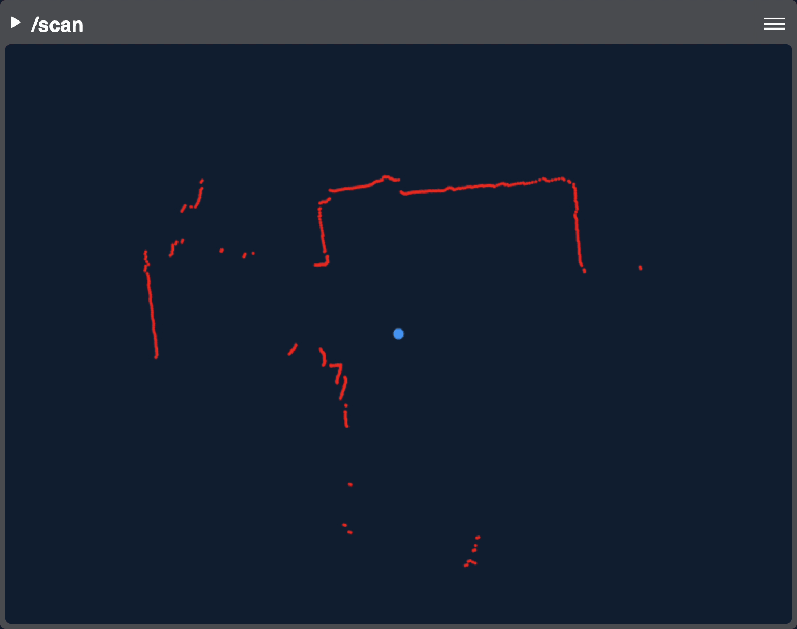

Built-in Panel Widgets
======================

The following panel widgets are provided out of the box. You can easily :doc:`create custom panel widgets </ui/custom-widgets>`, too.

Battery State
-------------
This panel displays robot's battery voltage from ``sensor_msgs/msg/BatteryState`` topics as a graph. (It will display current, too.)
See :ref:`sensor_msgs/msg/BatteryState <battery-state-config>` for configuration options.

Imu
---
This panel displays IMU data of ``sensor_msgs/msg/Imu`` topics as rotation, linear acceleration and angular velocity.

.. image:: ../img/widget-imu.gif
    :align: center
    :class: widget-imu

Laser Scan
----------
Displays 2D image of of a lidar scan for ``sensor_msgs/msg/LaserScan`` topics. You can zoom in and out and rotate the display.

Log
---
Displays system logs such as ``/rosout`` for ``rcl_interfaces/msg/Log`` topics.

.. image:: ../img/widget-log.gif
    :align: center
    :class: widget-log

Range
-----
Shows distance information from ``sensor_msgs/msg/Range`` as a number and color.

.. image:: ../img/widget-range.gif
    :align: center
    :class: widget-range

System Info
-----------
This panel displays system CPU load, memory and swap utilization, and free space for monitored disk volumes.
The info is generated by Phantom Agent via the ``phntm_interfaces/msg/SystemInfo`` topics.
See :doc:`Agent Configuration </basics/agent-config>` for available options.

.. image:: ../img/widget-system-info.gif
    :align: center
    :class: widget-system-info

Video
-----
Topic types: ``ffmpeg_image_transport_msgs/msg/FFMPEGPacket``, ``sensor_msgs/msg/Image``, ``sensor_msgs/msg/CompressedImage``
Besides being the default widget for any video, panel also allows to display overlay data from ``vision_msgs/msg/Detection2DArray`` topics.

Everything 3D
-------------
This is a compound widget that allows to display the URDF model from ``/robot_description`` and transforms from ``/tf`` and ``/tf_static``.
Model files are discovered on the robot, uploaded to the Cloud Bridge server and cached there.
It can also display some additional data from ``sensor_msgs/msg/CameraInfo``, ``vision_msgs/msg/Detection3DArray``, ``sensor_msgs/msg/LaserScan`` and ``sensor_msgs/msg/Range`` topics.