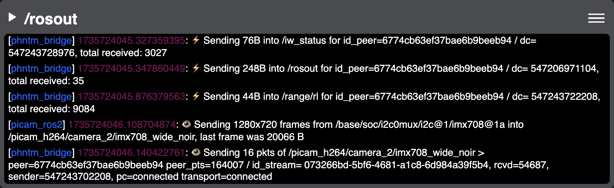
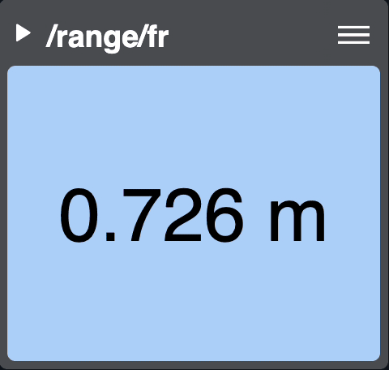

:github_url: https://github.com/PhantomCybernetics/phntm_bridge_docs/edit/main/ui/built-in-widgets.rst

Built-in Panel Widgets
======================

The following panel widgets are provided out of the box. You can easily :doc:`create custom panel widgets </ui/custom-widgets>`, too.

.. _3d-scene-view-widget:

3D Scene View
-------------
This is a *composite* widget that displays the URDF model from ``/robot_description`` and transforms from ``/tf`` and ``/tf_static``.
Model files are discovered on the robot, uploaded to the Cloud Bridge and cached there. Supported formats are STL and DAE
This can be meshed with additional data from ``sensor_msgs/msg/CameraInfo``, ``vision_msgs/msg/Detection3DArray``, ``sensor_msgs/msg/LaserScan`` and ``sensor_msgs/msg/Range`` topics.
See :ref:`CameraInfo <camera-info-config>` and :ref:`Detection3DArray <detection-array-config>` for configuration options.

The URDF model only updates when /robot_description changes, or on page reload.

[GIF]

(More features will be added to this widget, such as support for `visualization markers <https://github.com/PhantomCybernetics/bridge_ui/issues/7>`_ and `path planning <https://github.com/PhantomCybernetics/bridge_ui/issues/10>`_)

.. _battery-state-widget:

Battery State
-------------
This panel displays robot's battery voltage from ``sensor_msgs/msg/BatteryState`` topics as a graph.
See :ref:`BatteryState <battery-state-config>` for configuration options.

.. image:: ../img/widget-battery.gif
    :align: center
    :class: widget-battery

(Battery State `will display current <https://github.com/PhantomCybernetics/bridge_ui/issues/3>`_, too.)

Imu
---
This panel displays IMU data of ``sensor_msgs/msg/Imu`` topics as rotation, linear acceleration and angular velocity.

.. image:: ../img/widget-imu.gif
    :align: center
    :class: widget-imu

Laser Scan
----------
Displays 2D image of of a lidar scan for ``sensor_msgs/msg/LaserScan`` topics. You can zoom in and out and rotate the display.

.. image:: ../img/widget-laser.gif
    :align: center
    :class: widget-laser

Log
---
Displays system logs such as ``/rosout`` for ``rcl_interfaces/msg/Log`` topics.

Range
-----
Shows distance information from ``sensor_msgs/msg/Range`` as a number and color.

System Info
-----------
This panel displays system CPU load, memory and swap utilization, and free space for monitored disk volumes.
The info is generated by Phantom Agent via the ``phntm_interfaces/msg/SystemInfo`` topics.
See :doc:`Agent Configuration </basics/agent-config>` for available options.

.. image:: ../img/widget-system-info.gif
    :align: center
    :class: widget-system-info

.. _video-widget:

Video
-----
This is the default widget for any Video and Image topics, transmitted as H.264.
It allows to display overlay data from ``vision_msgs/msg/Detection2DArray`` topics.
See :ref:`Detection2DArray <detection-array-config>` and :ref:`Image <image-config>` for config options.

[GIF]