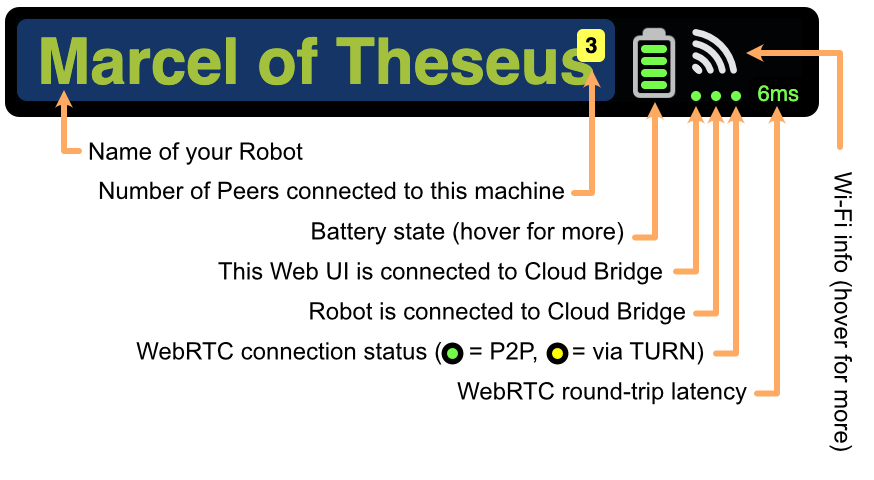
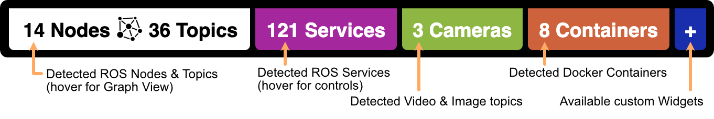
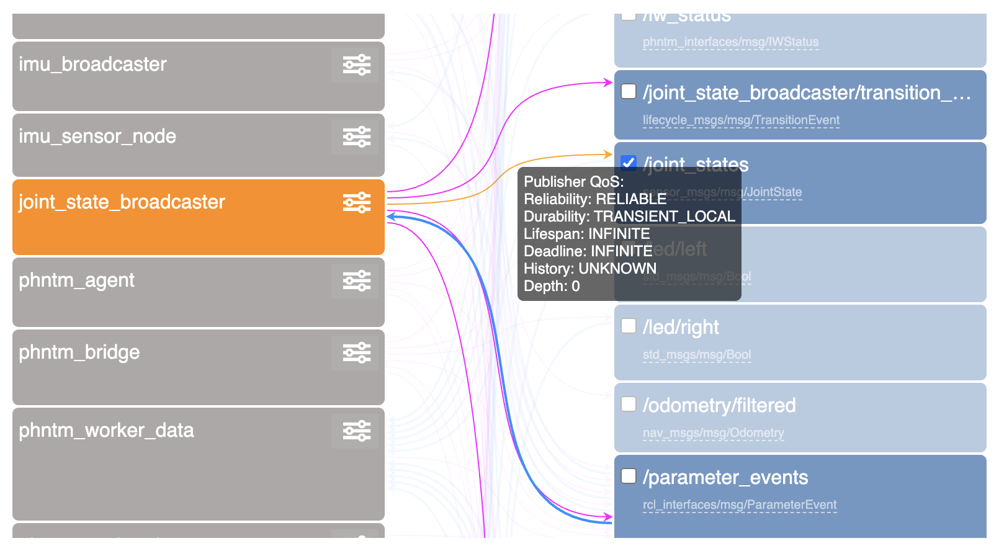
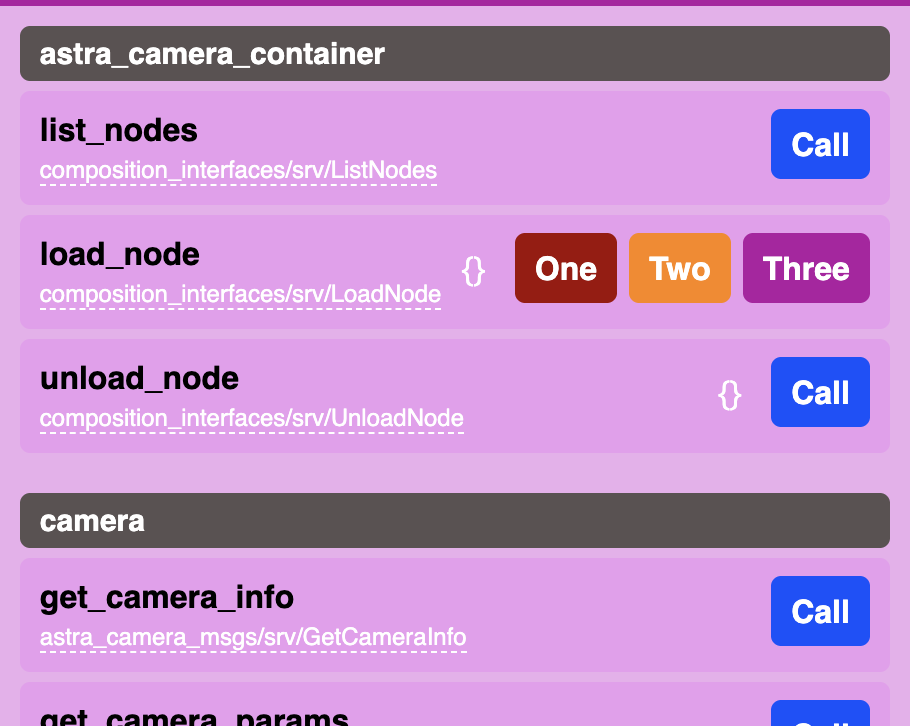
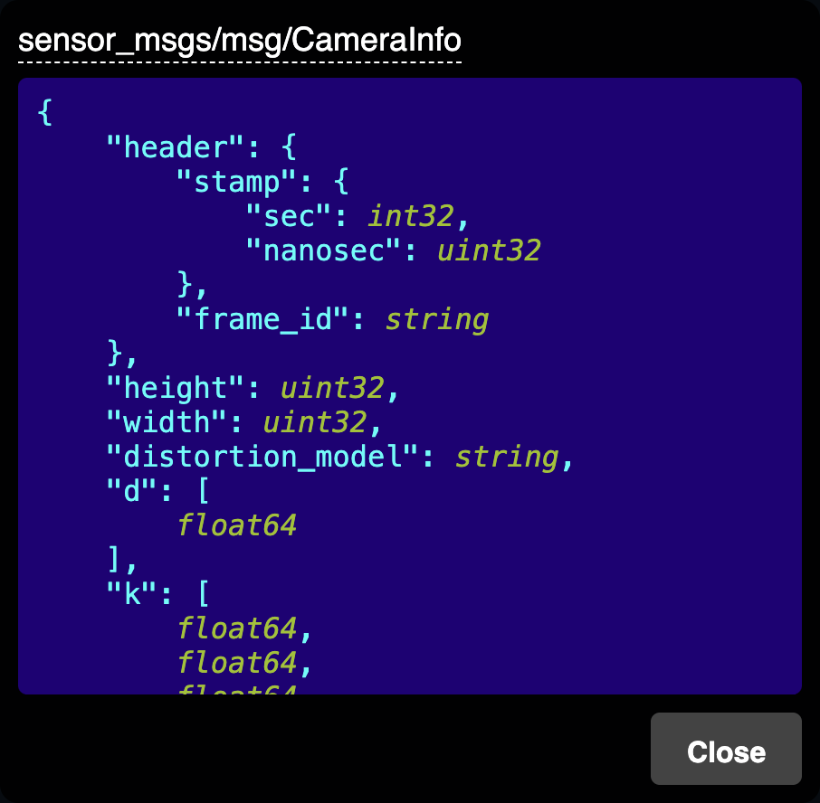

:github_url: https://github.com/PhantomCybernetics/phntm_bridge_docs/edit/main/ui/overview.rst

User Interface Overview
=======================

Phantom Bridge comes with a flexible web-based user interface. It can display autodetected topics either as raw 
deserialized data, or using visual widgets. Several widget types are :doc:`built in </ui-widgets/index>`, you can also easily :doc:`implement your own. </ui/customizing>`
You can :doc:`call any ROS service </ui/ros-services>`, set :doc:`runtime ROS parameters </ui/runtime-ros-parameters>`, and completely customize :doc:`input settings </ui/user-input-and-teleoperation>` for tele-operation.

.. Tip:: Full configuration of the displayed panels is stored in the URL.
         Share it with others and they will see exactly what you see, and be able to control the machine.

.. raw:: html

   <video width="100%" height="auto" autoplay loop class="ui-overview">
      <source src="/bridge/video/ui-overview.mp4" type="video/mp4">
      Your browser does not support the video tag.
   </video>

Most elements are designed to be intuitive and self-explanatory, here are some bits that may need a small introduction:

Connection State, Battery & Wi-Fi
---------------------------------

Discovered Resources
--------------------

.. _graph-view:

Nodes & Topics (Graph View)
---------------------------

Under the `Nodes & Topics` menu, you will find the Graph View. On the left you can see all the discovered ROS nodes,
on the right all discovered ROS topics. The connections between them signify which nodes publish and subscribe to which topics.

The icon next to the node's name opens a dialog allowing to :doc:`examine and modify runtime parameters </ui/runtime-ros-parameters>` of the node.
The checkbox next to a topic name opens a new panel for the topic.
Each connection in the graph shows publisher's and subscriber's QoS. A warning is displayed when a QoS mismatch is detected.

Services Menu
-------------

The `Services` menu allows you to call any discovered ROS service on your system. Some buttons are instantly available,
other may need to be configured. You can also make your own custom control widgets. :doc:`Read more here. </ui/ros-services>`

Input Manager
-------------

.. raw:: html
    
    

        Input disabled
        Input enabled
        Input producing messages
        <!-- Input locked by another user -->
        Input error
    

    

The monkey icon in the top-right corner opens the `Input manager`. Here you can map input from keyboard, gamepad or touchscreen
to ROS messages to be generted in order to tele-operate your ROS machine.

See :doc:`more about input here </ui/user-input-and-teleoperation>`.

.. raw:: html

    

Message Type Inspector
----------------------

Wherever you see a ROS message or service type (such as `sensor_msgs/msg/CameraInfo`), you can click on it to reveal its full
definition transcribed into a pseudo-JSON, as shown here. This is particularly useful as you don't need to look up
IDL/MSG/SRV type definitions and their nested sub-structures when working with a ROS system.

