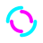

User Interface Overview
=======================

Phantom Bridge comes with a flexible web-based User Interface. It can display autodetected Topics either as raw 
deserialized data, or using visual widgets. Several widget types are :doc:`built in </ui/built-in-widgets>`, you can also easily :doc:`implement your own. </ui/custom-widgets>`
You can :doc:`call any ROS Service </ui/ros-services>`, set :doc:`runtime ROS Parameters </ui/runtime-ros-parameters>`, and completely customize :doc:`User Input </ui/user-input-and-teleoperation>` for tele-operation.

.. Tip:: The current configuration of the displayed panels and their settings are stored in the URL.
         You can share it with others and they will see exactly what you see, and be able to control the machine.

.. raw:: html

   <video width="100%" height="auto" autoplay loop>
      <source src="/bridge/video/ui-overview.mp4" type="video/mp4">
      Your browser does not support the video tag.
    </video>

Most elements are designed to be intuitive and self-explanatory, here are some bits that may need a small introduction:

Robot Connection & Status
-------------------------

.. image:: ../img/ui-header.png
    :align: center
    :class: ui-header

.. rst-class:: hidden-heading

Discovered Resources
--------------------

.. image:: ../img/ui-menu.png
    :align: center
    :class: ui-menu

.. _graph-view:

Nodes & Topics (Graph View)
---------------------------

Under the Nodes & Topics menu, you will find a Graph View like the one shown below. On the left you can see all the discovered ROS Nodes,
on the right all discovered ROS Topics. The connections between them signify which Nodes publish and subscribe to which Topics.
The icon next to the Node's name opens a dialog allowing to :doc:`examine and modify runtime parameters </ui/runtime-ros-parameters>` of each Node.
The checkbox next to a Topic name opens a new panel for the topic.
Each connection in the graph shows Publisher's and Subscriber's QOS. A warning is displayed when QOS mismatch is detected.

.. image:: ../img/ui-graph-view.png
    :align: center
    :class: ui-graph-view

Services Menu
-------------

The Services menu allows you to call any discovered ROS service on your system. Some buttons are instantly available, some need to be configured.
You can also make your own custom control widgets. :doc:`See more here. </ui/ros-services>`

.. image:: ../img/ui-services-menu.png
    :align: center
    :class: ui-services-menu

Introspection
-------------

This button controls Introspection (discovery of ROS Nodes, Topics, Services and Docker containers).
When animating as shown here, Introspection is running on the Robot. You can manually start and stop it at any time.

User Input Indicator
--------------------

If configured on the Robot, you will see the User Input menu on the top-right of the screen. 
Based on the current state of the input system, this is what the icon means.
More information about user input :doc:`can be found here. </ui/user-input-and-teleoperation>`

.. list-table::
   :widths: 5 95

   * - .. image:: ../img/ui-monkey-blue.png
        :align: left
        :class: ui-monkey

     - Input disabled

   * - .. image:: ../img/ui-monkey-green.png
        :align: left
        :class: ui-monkey

     - Input enabled and ready, not transmitting

   * - .. image:: ../img/ui-monkey-yellow.png
        :align: left
        :class: ui-monkey

     - Input enabled and transmitting

   * - .. image:: ../img/ui-monkey-red.png
        :align: left
        :class: ui-monkey

     - Error occured, not transmitting

.. image:: ../img/ui-message-definition.png
    :align: right
    :class: ui-message-definition

Message Type Inspector
----------------------

Wherever you see a ROS Message or Service type name (such as `sensor_msgs/msg/CameraInfo`), you can click on it to reveal its full definition transcribed into a pseudo-JSON, as shown here.
This is particularly useful as you don't need to look up IDL/MSG/SRV type definitions and their nested sub-structures when working with a ROS system.

