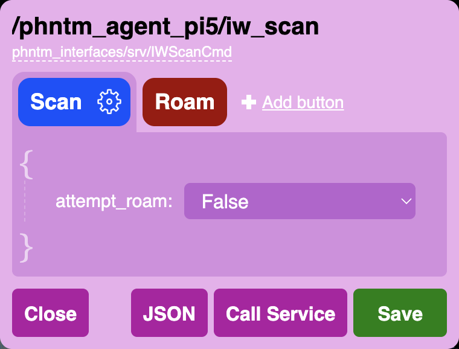
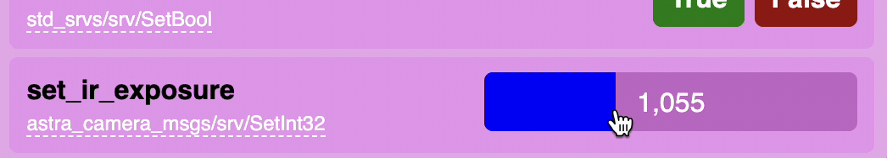

:github_url: https://github.com/PhantomCybernetics/phntm_bridge_docs/edit/main/ui/ros-services.rst

Calling ROS Services
====================

The Bridge Client node autodetects all available ROS services of all discovered nodes,
and the Web UI then provides various tools to call them with custom data payloads and receive replies.
Service calls can be even :doc:`mapped to keyboard keys, gamepad and touch UI buttons <user-input-and-teleoperation>`.

.. Note:: The services API provides a reliable way of calling ROS services, however, it is not designed with speed nor
          low latency in mind. All service requests are queued and processed in sequential order by the Bridge Client node
          which also waits for every service reply. If no reply arrives withing 20s, you will receive a `timeout` error.
          If you need to call a service several times per second, you should probably use topic messages instead.

In order to be able to call any ROS service, the Bridge node needs to have access to its type definitions. 
See :doc:`Custom message & Service types </basics/custom-message-types>` for more info.

The most basic service types (e.g. `std_srvs/srv/Empty`, `std_srvs/srv/Trigger` or `std_srvs/srv/SetBool`) come with
pre-defined user interface out of the box to make calling them as simple as clicking a button. For services that take more
complex input data, we first need to define the payload.

Configuring Service Buttons
---------------------------
In the `Services` dropdown menu, you will see the ``{}`` symbol next to each service name, clicking it opens a payload editor. 
The editor allows to define custom data to call the service with, and to save such calls as UI buttons.
All defined buttons are displayed next to the service name in the dropdown menu.

The example on the right shows a very basic input structure, the data can get much more complex.
The editor uses autodetected service type to provide as much guidance and input validation as possible. 
You can also test-call the service at any moment to check that your input produces desires outcome.

Similarly to the :doc:`input mapping configuration </ui/user-input-and-teleoperation>`, when you click `Save` in the service
payload editor, all configured buttons and asociated data will be stored only locally in your web browser. 
To make this setup available as the `default configuration` to other users and devices,
you need to export these definitions as a JSON and store them in a config file on the ROS machine.

You'll need to make this JSON file available to the Bridge Client's Docker container using the ``service_defaults`` parameter:

.. code-block:: yaml
   :caption: compose.yaml

    services:
      phntm_bridge:

        volumes:
          - ~/service_defaults.json:/ros2_ws/service_defaults.json # mount your JSON defaults into the container

And you also need to tell the Bridge to use it with the ``service_defaults`` parameter inside your `phntm_bridge.yaml` config file:

.. code-block:: yaml
   :caption: phntm_bridge.yaml

    /**:
      ros__parameters:

        service_defaults: /ros2_ws/service_defaults.json # path to config file as mapped inside the container

Restart the client / container and reload the Web UI. These service button definitions will be used as the defaults for all devices and users
accessing the robot’s Bridge Web UI. At any point, these defaults can be overridden by the user's own local configuration,
which always takes priority.

.. Note:: Modified service buttons are always saved and applied to the current web browser only.
          Changes need to be saved to your robot’s JSON defaults file in order to be applied to other peers or devices.
          Deleting the configuration in a web browser will reset it to the robot’s defaults on the next page load.

The JSON defaults file has the following structure:

.. code-block:: json
   :caption: service_defaults.json

    {
        "/node/service_id": [
            {
                "label": "Button label",
                "color": "red",
                "show_request": false,
                "show_reply": true,
                "value": { } // custom payload
            }
        ],
        "/other_node/other_service_id": [
            {
                "label": "Button 1 label",
                "color": "orange",
                "show_request": false,
                "show_reply": true,
                "value": { } // custom payload
            },
            {
                "label": "Button 2 label",
                "color": "magenta",
                "show_request": false,
                "show_reply": true,
                "value": { } // custom payload
            }
        ]
    }

.. _implementing-custom-service-widgets:

Implementing Custom Widgets
---------------------------

In addition to calling services with pre-configured payloads as described above, you can also create a completely unique controls
for any ROS service.

To do that, you need to extend the :doc:`ServiceInputBase </ui-api-docs/ServiceInputBase>` class and create a custom service widget that will be
displayed in the service dropdown menu in a similar fashion to the standard buttons. A custom widget is responsible for rendering of its own DOM
elements, and can be initialized by a value provided by a getter ROS service.

An example of such a widget - a slider menu element - can be found in the `Bridge UI Extras repo <https://github.com/PhantomCybernetics/bridge_ui_extras/tree/main/examples/custom-slider-service-widget>`_
and also in the :doc:`live demos </demos>`.

To register your custom service widget, include it in the UI using the ``ui_custom_includes_js`` parameter.
You can then map it to a service as shown below, plus any custom parameters to be passed to the widget.
The extra params defined for the service can be read using `this.client.getServiceConfig(id_service)` in your extended class.
Timeouts for each service call can be customized in `this.client.serviceCall()`.

.. code-block:: yaml
   :caption: phntm_bridge.yaml

    /**:
      ros__parameters:

        ui_custom_includes_js:
          - https://www.some-server.com/custom-service-widget.js
        
        # custom service menu widget mapping
        /some_node/some_service:
          menu_widget: CustomServiceWidget # widget class to use, must be included via ui_custom_includes_js
          custom_widget_param_1: 0.5 # custom attributes for the widget class follow
          custom_widget_param_2: 'This is a string param'
          custom_widget_param_3: False
          custom_widget_getter_service: /some_node/some_other_service

See :doc:`Customizing the User Interface </ui/customizing>` for more details on how to host the extension files and :doc:`ServiceInputBase </ui-api-docs/ServiceInputBase>` for
API reference.