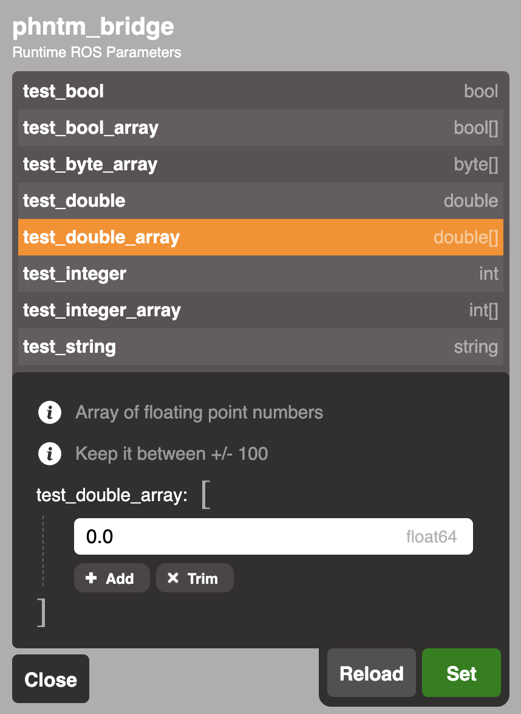

:github_url: https://github.com/PhantomCybernetics/phntm_bridge_docs/edit/main/ui/runtime-ros-parameters.rst

Runtime ROS Parameters
======================

In the :ref:`Graph View <graph-view>`, the icon next to every ROS node name opens the `Parameter Inspector`, as shown here.

This dialog allows to inspect and modify any ROS parameters declared by the node. Parameters marked as `read_only` can not be edited.
Input is validated according to parameter's type, `description` and `additional_constraints` are displayed as text hints.

The ROS node needs to provide services of type `rcl_interfaces/srv/ListParameters`, `rcl_interfaces/srv/DescribeParameters`, `rcl_interfaces/srv/GetParameters` and `rcl_interfaces/srv/SetParameters` for this functionality to work.
This is best achieved by instantiating the node class with `start_parameter_services=True`.
You also need to spin the node to process these service requests.

You can adjust permissions for parameter services with the following configuration:

.. code-block:: yaml
   :caption: phntm_bridge.yaml

    /**:
      ros__parameters:

        blacklist_parameter_services:
          - controller_manager # nodes with disabled parameter services
        enable_node_parameters_read: True
        enable_node_parameters_write: False # only reading allowed