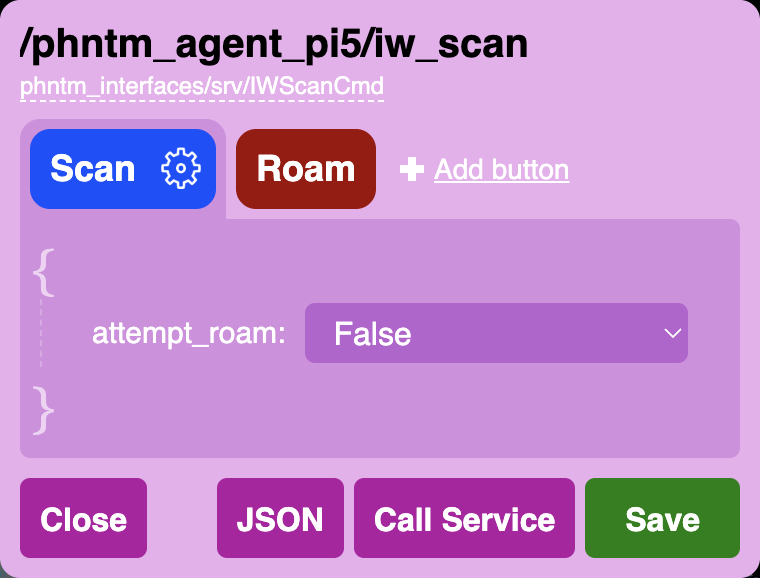
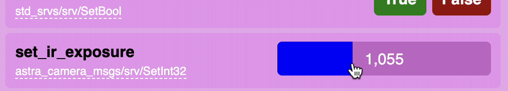

Services
========

The Bridge node autodetects all available ROS services of all discovered ROS nodes,
and the Web UI then provides various tools to call them with custom data payloads.
Service calls can be even mapped to keyboard keys, gamepad and touch UI buttons.

In order to be able to call any ROS service, the Bridge node needs to have access to its type definitions. 
See :doc:`Custom message & Service types </basics/custom-message-types>` for more info.

The most basic service types (e.g. `std_srvs/srv/Empty`, `std_srvs/srv/Trigger` or `std_srvs/srv/SetBool`) come with pre-defined user interface out of the box to make calling them as simple as possible.
For services that take more complex input data, we first need to define the payload.

Configuring service buttons
---------------------------
In the Services dropdown menu, you will see the **{}** symbol next to each service name, clicking it opens an input editor. 
The editor allows to define custom data to call the service with, and to save such calls as UI buttons.
All defined buttons are displayed next to the service name in the dropdown menu.

The example on the right shows a very basic input structure, the data can get much more complex.
The editor uses autodetected service type to provide as much guidance and input validation as possible. 
You can also test-call the service at any moment to check your input produces the desires outcome.

Similarly to :doc:`input mapping configuration </ui/user-input-and-teleoperation>`, when you click `Save` in the service input editor, all configured buttons and asociated data will be stored only locally in your web browser. 
To make this setup available as the default configuration to other users and/or devices you use to interact with the robot, you need to export these as JSON, save to a .json file and add it to your robot's config in phntm_bridge.yaml:

.. code-block::
   :caption: phntm_bridge.yaml

    service_defaults: /ros2_ws/phntm_services_config.json # path to config file as mapped inside the container

These service button definitions are then used as the defaults for all devices and users accessing the robot’s Bridge Web UI.
At any point, these defaults can be overridden by the local browser’s settings, which always take priority.

.. Note:: Modified service buttons are always saved and applied to the current web browser only. Changes need to be saved to your robot’s `phntm_services_config.json` file in order to be applied to other peers or devices you may want to control the robot with. Deleting the configuration in a web browser will reset it to the robot’s defaults on the next Web UI page load.

Implementing custom widgets
---------------------------
On top of the above mentioned options, you may want to create a completely unique controls for a ROS service. 
The best way to do that would be to create a custom service widget, which is then used in the service dropdown menu in a similar fashion to the buttons.

Custom service widgets should be implemented by extending the `CustomServiceInput <https://github.com/PhantomCybernetics/bridge_ui/blob/main/static/input/custom-service-input.js>`_ class. 
See the `bridge_ui_extras <https://github.com/PhantomCybernetics/bridge_ui_extras>`_ repo and in particular `custom-service-slider-widget.js <https://github.com/PhantomCybernetics/bridge_ui_extras/blob/main/examples/custom-service-slider-widget.js>`_ to get an idea of what a service widget class can look like. Here's the ServiceInput_ExampleSlider in action:

To register your custom service widgets, use the `custom_service_widgets` and `service_widgets` parameters in your phntm_bridge.yaml config file as shown below:

.. code-block::
   :caption: phntm_bridge.yaml

    custom_service_widgets: # first, add widget classes to load
     - 'ServiceInput_ExampleSlider https://my-domain.com:443/custom-service-slider-widget.js' # class name, space, source file URL to be loaded
    service_widgets: # then map services to widget classes
     - '/camera/set_ir_exposure ServiceInput_ExampleSlider {"min": 1, "max": 3000, "value_read_srv": "/camera/get_ir_exposure"}' # service id, space, class name, space, custom JSON data to pass
     - '/camera/set_ir_gain ServiceInput_ExampleSlider {"min": 0, "max": 20000, "value_read_srv": "/camera/get_ir_gain"}'

.. Note:: The services API provides a reliable way of calling ROS services, however, it is not designed with speed nor low latency in mind. All service requests are queued and processed in sequential order by the Bridge node which also waits for every service reply. If no reply arrives withing 10s, you will receive a `timeout` error. If you need to call a service say several times per second, you should probably use topic messages instead.