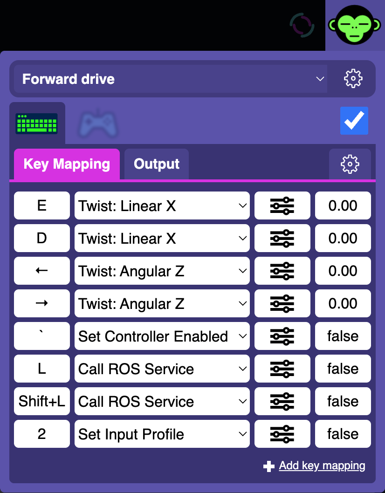
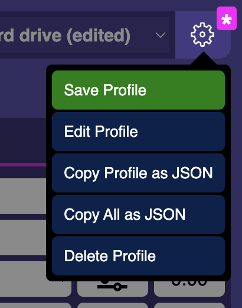

User input & Teleoperation
============================

The Web UI offers a comprehensive set of tools for mapping user input from a keyboard, gamepad or touch screen to ROS messages. This allows an operator to manually
drive the robot, and to control various actuators and other systems from the comfort of a web browers both when the robot is right next to you, but also remotely over the internet from many readily available devices.

Keyboard keys, gamepad buttons and axes, as well as virutal touch gamepad and buttons can be configured to generate certain kinds of ROS messages that the machine may already understand (such as `sensor_msgs/msg/Joy`, `geometry_msgs/msg/Twist` or `TwistStamped`).
You can also call ROS services and trigger various UI functions, or even control Docker containers by mapping input buttons to Agent node's `docker_command` service.  A completely unique output can be achieved by implementing a custom input driver.

This provides a plug-and-play enhancement of existing teleop and control mechanisms, while improving user experience, overcoming the typical range limitation of Bluetooth, and offering vastly more flexibility.

Input profiles
--------------
Input configuration is organized into profiles. The idea is that rather than having all possible actions configured as many keys or buttons at all times, a profile can be selected with a certain state of the machine or with a key press.
For example, when a mobile robot is equipped with a separate backup camera and a manipulator arm, you can switch to a "Reversing" profile that changes your steering and forward directions (perhaps even speed) when backing up.
Similarly, you can switch to a "Manipulator" profile only when controlling the arm and the robot is otherwise stationary.

The configuration process
-------------------------

When you first install Phantom Bridge on your machine, there's no default input configuration.
In your phntm_bridge.yaml config file, you can allow only certain input drivers to be enabled in the UI, these should be only the drivers generating messages the robot can understand.
The built-in input drivers are `Twist` and `Joy` (note that the Twist driver can generate both Twist and TwistStamped messages)

.. code-block::
   :caption: phntm_bridge.yaml
    
    input_drivers: [ 'Twist', 'Joy' ]

Restart the Bridge node, reload the Web UI. Now you can use the user interface to set up input mapping for any connected controllers.
Control ROS messages will be generated when each controller is active and enabled, and transmitted to your machine over the fast UDP WebRTC data channels.

You can start testing and/or implementing your control logic. The `Save Profile` button then stores your current configuration locally in your web browser.
When happy with your configuration, you can export it as JSON data and store on the robot as a .json config file.
To tell the Bridge node which file to use, use `input_defaults` parameter in your phntm_bridge.yaml like so:

.. code-block::
   :caption: phntm_bridge.yaml

    input_drivers: [ 'Twist', 'Joy' ] # enabled input drivers
    input_defaults: /ros2_ws/phntm_input_config.json # path to input config file as mapped inside the container

This setup is then used as the defaults for all devices and users accessing the robot's Bridge Web UI.
At any point, these defaults can be overridden by the local browser's settings which always take priority.

.. Note:: Modifying input profiles and configuration is always saved and applied to the current web browser only. Changes need to be saved to your robot's `phntm_input_config.json` file in order to be applied to other peers or devices you may want to control the robot with. Deleting the configuration or a profile in a web browser will reset it to the robot's defaults on the next Web UI page load.

Custom Touch UI buttons
-----------------------
On touchscreen devices, the interface can be extended by defining extra custom buttons that will be placed in the top or bottom part of the screen.
These can be configured like any other keyboard or gamepad buttons and will be accompanied by a virtual gamepad, useful for controlling up to 4 custom output axes.
You can change the display order of these buttons by dragging them around, and even use emojis as icons to save on valuable screen space.

Implementing custom drivers
---------------------------
Custom input drivers should be implemented by extending the `InputDriver <https://github.com/PhantomCybernetics/bridge_ui/blob/main/static/input/base-driver.js>`_ class. 
See the `bridge_ui_extras <https://github.com/PhantomCybernetics/bridge_ui_extras>`_ repo and `custom-input-driver.js <https://github.com/PhantomCybernetics/bridge_ui_extras/blob/main/examples/custom-input-driver.js>`_ in particular to get an idea of what the input and output of a driver should look like.
You can also examine the built-in `JoyInputDriver <https://github.com/PhantomCybernetics/bridge_ui/blob/main/static/input/joy-driver.js>`_ and `TwistInputDriver <https://github.com/PhantomCybernetics/bridge_ui/blob/main/static/input/joy-driver.js>`_ classes. 

In order to add a new driver to the Web UI, you need to host it somewhere on the internet where it can be accessed by a web browser. For development and testing purposes, this can even be your localhost. It is important for the web server to provide a valid SSL certificate, otherwise the browser will complain about unsecure content.

To register your custom input driver, use the `custom_input_drivers` parameter in your phntm_bridge.yaml config file like so:

.. code-block::
   :caption: phntm_bridge.yaml

    input_drivers: [ 'Twist', 'ExampleCustomDriver' ] # you can combine enabled input drivers with the built-in ones
    custom_input_drivers: 
     - 'ExampleCustomDriver https://my-domain.com:443/custom-input-driver.js' # class name, space, source file URL to be loaded