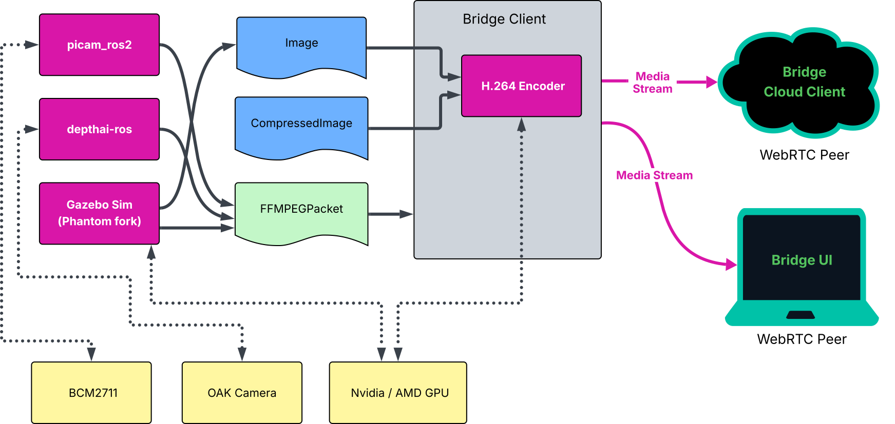

:github_url: https://github.com/PhantomCybernetics/phntm_bridge_docs/edit/main/video-and-image-topics.rst

Video & Image Topics Transmission
=================================

Phantom Bridge transmits all video as H.264 via WebRTC media streams. ROS `Image` and `CompressedImage` messages are also converted into H.264,
this includes depth frames and compressed image frames. 

Hardware-encoded H.264 Video
----------------------------
Having video streams encoded into H.264 by a hardware accelerator or GPU is preferable as it doesn't come at extra CPU cost.
In this scenario, the Bridge Client simply packetizes received `FFMPEGPacket <https://github.com/ros-misc-utilities/ffmpeg_image_transport_msgs/blob/master/msg/FFMPEGPacket.msg>`_ messages
and transports them via a WebRTC media stream.

The Bridge Client can also perform transcoding of Image/Compressed messages into H.264 using either the CPU (expensive), Nvidia or AMD GPU. 
There are several camera models on the market that can produce hardware-encoded H.264 frames (such as `OAK cameras by Luxonis <https://www.luxonis.com>`_).
If you're using Raspberry Pi with CSI cameras, consider our `picam_ros2 package <https://github.com/PhantomCybernetics/picam_ros2>`_ which utilizes hardware encoder when available, or performs CPU encoding with low latency.

.. list-table::
   :widths: 50 33 33
   :header-rows: 1

   * - System
     - H.264 Encoding Support
     - Encoder

   * - Raspberry Pi 5
     - Software only
     - Bridge Client
     
   * - 
     - 
     - `picam_ros2 <https://github.com/PhantomCybernetics/picam_ros2>`_
    
   * - Raspberry Pi 4B / Compute Module 4
     - Hardware (BCM2711)
     - `picam_ros2 <https://github.com/PhantomCybernetics/picam_ros2>`_
    
   * -
     - Software only
     - Bridge Client

   * - Jetson Orin Nano 
     - Software only
     - Bridge Client

   * - Linux with Nvidia GPU
     - Hardware (CUDA)
     - Bridge Client

   * - Linux with AMD GPU
     - Hardware (VAAPI)
     - Bridge Client

   * - OAK Cameras
     - Hardware 
     - `depthai-ros <https://docs.luxonis.com/software/ros/depthai-ros/>`_

   * - Gazebo Sim (Phntm Fork with GPU)
     - Hardware (CUDA or VAAPI)
     - `gz-sensors (fork) <https://github.com/PhantomCybernetics/gz-sensors>`_

*(if you'd like to add tested hardware setup to this list, edit the page)*

When using the H.264 Encoder of the Bridge Client with a GPU, some software scaling is often necessary to transform raw camera frames into the format supported by the hardware codec.
This can be mitigated by matching camera's pixel format with supported codec input by the hardware.

In case you're running Gazebo for headless simulations (cloud-based), consider adopting our `customized version of Gazebo Harmonic <https://github.com/PhantomCybernetics/simbot_gz>`_. In our setup,
the CameraSensor avoids using the ros_gz_bridge and publishes H.264 hw-encoded frames (as well as raw Image frames) directly into a ROS topic for low latency and maximum performance.

ROS Image & CompressedImage Messages
------------------------------------
All ROS sensor_msgs/msg/Image and sensor_msgs/msg/CompressedImage messages will be transcoded into H.264 and packetized before transmission.
Mainly software transcoding and compression is likely to have an impact on your system's enengy consumtion and cut down on resources.
Even software encoding can achieve very low latency, for instance Raspberry PI 5 performs quite well despite lacking hardware encoder.
However, performance will vastly depend on your hardware setup and CPU utilization.

In case of software transcoding, consider dedicating at least one CPU core to the encoder.

The following frame encodings are supported by the Bridge Client encoder: **rgb8** and **bgr8** (for RGB), **16UC1**, **mono16** and **32FC1** (for depth frames).
**JPEG** or **PNG** frames are accepted as CompressedImage.

You can adjust the behavior of the encoder by the following params:

.. code-block::
   :caption: phntm_bridge.yaml
    
    /**:
    ros__parameters:
        encoder_hw_device_default: '' # 'cuda', 'vaapi' or 'sw'

        /input_topic:
            encoder_hw_device: '' # 'cuda', 'vaapi' or 'sw'
            TODO full list

Depth Processing
----------------
ROS Image messages containing depth frames will be processed and colorized for better visibility.
As mentioned above, 16UC1, mono16 and 32FC1 frame encoginds are supported at this point.

You can adjust the behavior of the encoder by the following params:

.. code-block::
   :caption: phntm_bridge.yaml
    
    /**:
    ros__parameters:
         /some_depth_image_topic:
            max_sensor_value: 4000.0 # depth max distance/sensor value for normalizing
            colormap: 13 # cv2.COLORMAP, e.g. 13 = cv2.COLORMAP_MAGMA

Notes
-----
Although some cameras offer Ogg/Theora output, this format is not supported by Phantom Brige at this point.
The WebRTC standard does not include it (transcoding into H.264 would be necessary), and most web browser implemenations `are depricated anyway <https://caniuse.com/ogv>`_.