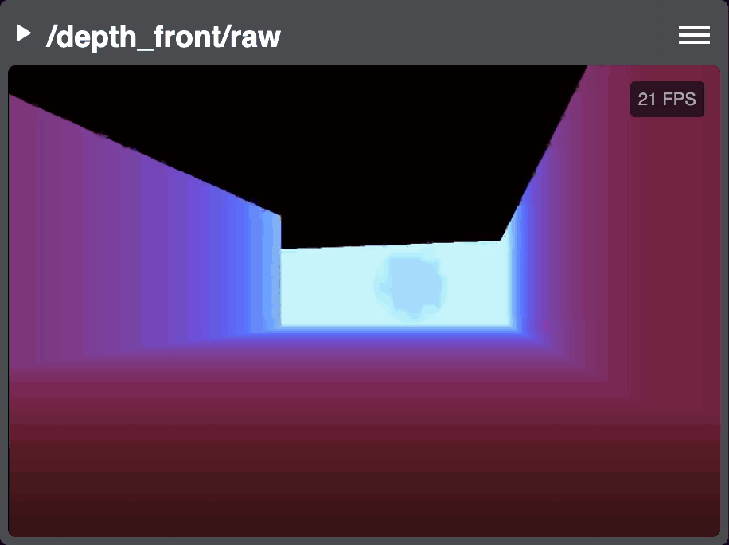

:github_url: https://github.com/PhantomCybernetics/phntm_bridge_docs/edit/main/video-and-image-topics.rst

Video & Image Topics Transmission
=================================

Phantom Bridge transmits all video as H.264 via WebRTC media streams. ROS ``Image`` and ``CompressedImage`` messages are also converted into H.264,
this includes depth frames. ``FFMPEGPacket`` messages are used for pre-encoded video frames.

Hardware-encoded H.264 Video
----------------------------
Having video streams encoded into H.264 by a hardware accelerator or GPU is preferable as it doesn't come at extra CPU cost.
In this scenario, the Bridge Client simply packetizes and timestamps the received `FFMPEGPacket <https://github.com/ros-misc-utilities/ffmpeg_image_transport_msgs/blob/master/msg/FFMPEGPacket.msg>`_ messages
and transports them via a WebRTC media streams.

The Bridge Client can also perform transcoding of `Image` and `CompressedImage` messages into H.264 using either the CPU (expensive), Nvidia, Intel or AMD GPU. 
There are several camera models on the market that can produce hardware-encoded H.264 frames (such as `OAK cameras by Luxonis <https://www.luxonis.com>`_).
If you're using Raspberry Pi with CSI cameras, take a look at our `picam_ros2 package <https://github.com/PhantomCybernetics/picam_ros2>`_
which utilizes hardware encoder when available, or performs CPU encoding with very low latency.

.. list-table::
   :widths: 50 33 33
   :header-rows: 1

   * - System
     - H.264 Encoding Support
     - Encoder

   * - Raspberry Pi 5
     - Software only
     - Bridge Client
     
   * - 
     - Software only
     - `picam_ros2 <https://github.com/PhantomCybernetics/picam_ros2>`_
    
   * - Raspberry Pi 4B / Compute Module 4
     - Hardware (BCM2711)
     - `picam_ros2 <https://github.com/PhantomCybernetics/picam_ros2>`_
    
   * -
     - Software only
     - Bridge Client

   * - Jetson Orin Nano 
     - Software only
     - Bridge Client

   * - Nvidia GPU
     - Hardware (CUDA)
     - Bridge Client

   * - AMD GPU
     - Hardware (VAAPI)
     - Bridge Client

   * - Intel GPU (untested)
     - Hardware (VAAPI)
     - Bridge Client

   * - OAK Cameras
     - Hardware 
     - `depthai-ros <https://docs.luxonis.com/software/ros/depthai-ros/>`_

   * - Gazebo Sim (Phntm fork + Nvidia / AMD GPU)
     - Hardware (CUDA or VAAPI)
     - `gz-sensors <https://github.com/PhantomCybernetics/gz-sensors>`_

When using the H.264 encoder of the Bridge Client with a GPU, some software scaling is often necessary to transform raw camera frames
into the format supported by the hardware codec. This can be sometimes mitigated by matching camera's output pixel format with the codec
input supported by the encoding hardware.

Transcoding of `CompressedImages` can be done on the GPU as well, there is an extra step for decompressing the JPEG or PNG frames done on the CPU
which takes place before encoding into H.264.

.. image:: ./img/video-encoding.svg
    :class: video-encoding

ROS Image & CompressedImage Messages
------------------------------------
All ROS ``sensor_msgs/msg/Image`` and ``sensor_msgs/msg/CompressedImage`` messages will be transcoded into H.264 and packetized before transmission.
Software transcoding and compression is likely to have an impact on your system's enengy consumtion and cut down on resources, but can achieve very low latency,
for instance Raspberry PI 5 performs quite well despite lacking a hardware encoder. Performance will mainly depend on your hardware setup and CPU utilization.

In case of software transcoding, consider dedicating at least one CPU core to the encoder.

The following frame formats are supported by the Bridge Client encoder, type must be correctly stated in message headers:

.. list-table::
   :widths: 30 70
   :header-rows: 1

   * - Type
     - Supported Formats
   * - RGB Image
     - ``rgb8``, ``bgr8``
   * - Depth / Mono Image
     - ``mono8`` / ``8uc1``, ``mono16`` / ``16uc1``, ``32uc1``, ``32fc1``
   * - JPEG CompressedImage
     - ``rgb8``, ``bgr8``
   * - PNG CompressedImage
     - ``rgb8``, ``bgr8``, ``rgb16``, ``bgr16``

Configuration Options
---------------------

You can adjust the behavior of the encoder by the following params. There are different QoS defaults defined for `Image/CompressedImage` topics and for
encoded `FFmpeg` topics. All encoded frames should be transmitted as they rely on one another for decoding. When the Bridge Client encodes raw or compressed frames,
it intentially drops messages in order to prevent lag buildup.

.. code-block:: yaml
   :caption: phntm_bridge.yaml
    
    /**:
    ros__parameters:

        # Defaults
        encoder_hw_device_default: 'vaapi' # 'cuda' for Nvidia, 'vaapi' for AMD/Intel or 'sw' for CPU (default)
        encoder_default_thread_count: 2
        encoder_default_gop_size: 30 # key frame every N frames
        encoder_default_bit_rate: 5000000 # 610 KB/s

        # QoS defaults for all Image/CompressedImage topics
        image_topics_default_depth: 1
        image_topics_default_reliability: BEST_EFFORT
        image_topics_default_durability: VOLATILE
        image_topics_default_lifespan_sec: -1.0

        # QoS defaults for all encoded Video topics
        video_topics_default_depth: 10
        video_topics_default_reliability: RELIABLIE
        video_topics_default_durability: VOLATILE
        video_topics_default_lifespan_sec: -1.0

        # Image or CompressedImage frames
        /some_image_topic:
          encoder_hw_device: 'vaapi' # 'cuda' for Nvidia, 'vaapi' for AMD/Intel or 'sw' for CPU
          create_node: True # create a dedicated ROS node for this topic
          debug_num_frames: 10 # will print debug for this many frames (incl. NAL units)
          encoder_thread_count: 2 
          encoder_gop_size: 30 # key frame every N frames
          encoder_bit_rate: 5000000 # 610 KB/s

        # Encoded FFmpeg video frames
        /some_ffmpeg_packet_frame:
          debug_num_frames: 10 # will print debug for this many frames (incl. NAL units)
          create_node: True # create a special ROS node for this topic

Depth Processing
----------------

ROS ``Image`` messages containing depth frames will be processed and colorized for better visibility.
For colorizing, `OpenCV ColorMap <https://docs.opencv.org/3.4/d3/d50/group__imgproc__colormap.html>`_ values are used as integer.

.. code-block:: yaml
   :caption: phntm_bridge.yaml
    
    /**:
    ros__parameters:

      /some_depth_image_topic:
        max_sensor_value: 4000.0 # max depth distance or sensor value (for normalizing)
        colormap: 13 # cv2.COLORMAP, e.g. 13 = COLORMAP_MAGMA

Notes
-----
* In case you use Gazebo for headless simulations like we do :doc:`in our demos </demos>`, consider adopting our customized version of Gazebo Harmonic's
  `gz-sensors <https://github.com/PhantomCybernetics/gz-sensors>`_ and `gz-rendering <https://github.com/PhantomCybernetics/gz-rendering>`_ packages.
  In our setup, the `CameraSensor` and `DepthCameraSensor` avoid using the `ros_gz_bridge` and publish H.264 hw-encoded frames as well as raw Image frames directly
  into ROS topics. Hardware encoder (similar to the one in Bridge Client) is built into the `gz-sensors` package. Without these changes, Gazebo performs very poorly.
* Although some cameras offer `Ogg/Theora` output, this format is not supported by Phantom Brige.
  The WebRTC standard does not include it (transcoding into `H.264` would be necessary), and most web browser
  implemenations `are depricated <https://caniuse.com/ogv>`_.